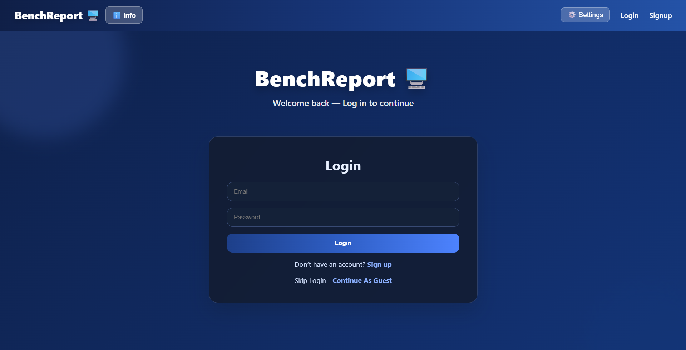
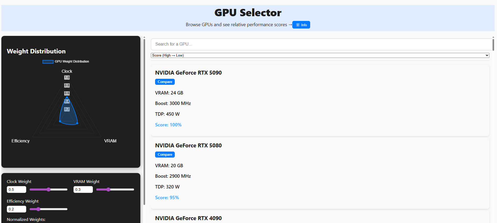
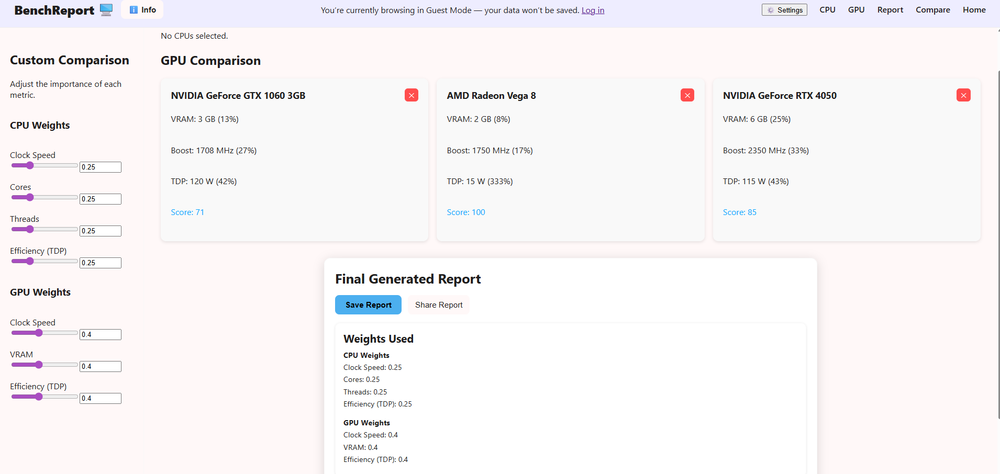

# HardwareAppRepo
Full-Stack Benchmarking Platform for GPU/CPU Performance Metrics

# Description
BenchReport is a full stack React + Node.js application for analyzing, comparing, and sharing computer hardware benchmark data. 
It uses advanced scoring systems (baseline settings, weight normalization, and diminishing returns) to produce meaningful CPU/GPU 
performance comparisons. The application implements JWT secured user authentication, benchmark logging, detailed system reports
and also features for saving, sharing and loading reports (using MongoDB).

# How to run the site
BenchReport is currently live on Vercel at: https://hardware-app-repo.vercel.app   [copy and paste into browser]

- You will initially be directed to the login page.
- Navigate to the signup page to create an account.
- The backend is hosted on Render — it may take up to one minute to spin up if idle.
- After signup, you will be redirected to the login page.
- Upon logging in, you can begin running benchmarks and viewing reports. Click the info button for more instructions!

# Screenshots
Home page: 

GPU selection page:

Comparison/Report page:

# Development Process

Tools & Technologies:
- React for frontend UI, pages architecture, and state management, CSS for styling
- Node.js + Express backend API, routing, auth-middleware
- JWT auth for securing user sessions and route protection
- Database (MongoDB) database logging including reports and user accounts
- Chart.js for visual interactive weighting
- Docker for containerization + Environment variables config
- Vercel for frontend + Render for backend hosting deployment

Workflow:
-First started with basic UI and pages (Home) and backend testing
-Built scoring logic system (weight normalization, baseline comparisons, and diminishing returns)
and used sample datasets
- Implemented Login/Signup and auth routes + guest mode feature
- Integrated backend (server.js) and frontend via REST API
- Added benchmark report saving, loading, and sharing features
- Finally containerized and deployed frontend and backend to separate hosting environments

Challenges Faced:
- Scoring logic was oddly complex (needed a way to make the user have full control over the scoring system)
- For instance, I didn't want the system to assume that "higher scores were better" so thats why the weight system
plus baseline settings were designed in a way that allowed users to prioritize their individual needs 
- Trying and configuring different deployment platforms (Railway, Render, Vercel)
- Containerization via Docker and configuring environment variables for deployment (they weren't being recognized by the servers)

# Why I built this and other recommendations

- I originally built BenchReport after realizing that most existing computer hardware comparison tools were extremely limited. In that they 
often relied on fixed scoring systems and preset benchmarks. And that technically a "better/faster" cpu or gpu isn't always better
for everyone, in that some users prioritize efficiency while others may need higher power. 
- So the goal was to build something that was as transparent and customizable as possible and genuinely useful for decision making.
  
- Actually the original idea also partly came from talking to AI asking for GTA 6 hardware recommendations, and I realized that this
could be something that would be actaully useful.

-Anyways, if I were to expand this, I would definately include a blogs page, public accounts, maybe AI assisted recommendations, more specs (ie RAM types, full pc builds, real time price fetching) that would make it even more useful as a true software tool!

